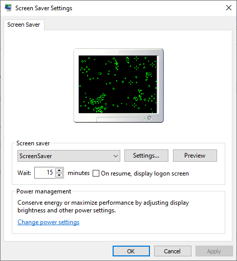
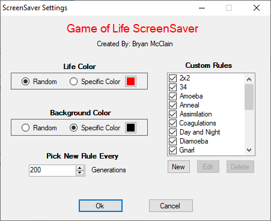
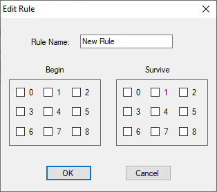

# GOL ScreenSaver
Game of Life Screensaver written in Visual Basic

<br />

## About



This scrensaver is based on the tutorial [Creating a Screen Saver with C#](https://sites.harding.edu/fmccown/screensaver/screensaver.html).
It was programmed using Microsoft Visual Basic 2010 Express Edition, but it should compile and run in later versions.
Once you build the program using Visual Studio, you need to rename the file `ScreenSaver/bin/Release/ScreenSaver.exe` from `ScreenSaver.exe` to `ScreenSaver.scr`.
Then, you should be able to right-click the file and install the screensaver program.

The screensaver draws a grid of cells using rules from [Conway's Game of Life](https://en.wikipedia.org/wiki/Conway%27s_Game_of_Life).
The Game of Life takes place on a square grid, where every cell in the grid is either dead or alive.
With this program, the grid starts with each cell dead or alive randomly, although other programs allow you to specify the cells manually.
On each iteration, the program looks at every cell in the grid and counts the number of orthogonal and diagonal neighbors (live cells).
A cell can have between 0 and 8 neighbors:

```
 1  2  3
 4 [#] 4
 6  7  8
```

Next, the program looks at the rules for a particular life instance. Each rule is expressed using `B/S` notation.
For example:

```
B123/S456
```

- `B123` - Any dead cells that have 1, 2, or 3 live cell neighbors will turn into a live cell this iteration. Otherwise, they will stay a dead cell.
- `S456` - Any live cells that have 4, 5, or 6 live cell neighbors will stay alive this iteration. Otherwise, they will turn into a dead cell.

The default rule invented by John Conway is `B3/S23`. However, by chaning these simple rules, we can generate all
kinds of cool life patterns. Computing the new state of all cells in the grid is called the next `Generation`.

<br />

## Configuration Menu



The configuration screen gives you a variety of options for customizing the screensaver.
You can pick a specific color for both the background and the life cells, or use a random color.
The delay lets you specify the number of generations before it picks a new rule and randomizes the grid.

You also have the option to define custom rules to use. Click `New` to create a new rule, or select a rule and click `Delete` to remove a rule.
Rules can be individually enabled or disabled using the checkbox. Unchecking a rule means it will not show in the screensaver.
Click on the `Edit` button to change the rule properties. This will show the following screen:



From here, you can rename the rule and specify the number of neighbors for `Begin` and `Survive`.

_All configuration settings are saved in the Windows Registry_
